<div align="center">

# 🏦 Finance & Banking Evolution Program

## **356 clases · 23 partes · 534 horas · de calcular un porcentaje a defender un banco digital**

**El programa de finanzas y banca más completo en español — desde aritmética financiera, presupuesto personal y contabilidad NIIF hasta crédito, riesgos, Basilea III, cumplimiento, finanzas abiertas, pagos transfronterizos, DLT, stablecoins y mercados tokenizados.**

[](https://github.com/vladimiracunadev-create/finance-and-banking-evolution-program/actions/workflows/ci.yml)
[](https://github.com/vladimiracunadev-create/finance-and-banking-evolution-program/actions/workflows/security.yml)
[](https://github.com/vladimiracunadev-create/finance-and-banking-evolution-program/actions/workflows/codeql.yml)
[](https://vladimiracunadev-create.github.io/finance-and-banking-evolution-program/)

[](CHANGELOG.md)
[](SYLLABUS.md)
[](STATUS.md)
[](https://vladimiracunadev-create.github.io/finance-and-banking-evolution-program/descargas/programa-completo.pdf)
[](https://github.com/vladimiracunadev-create/finance-and-banking-evolution-program/releases/latest)
[](https://github.com/vladimiracunadev-create/finance-and-banking-evolution-program/releases/latest)
[](SYLLABUS.md)
[](LICENSE)

[](apps/)
[](modules/04-contabilidad-financiera/README.md)
[](modules/11-regulacion-cumplimiento-y-auditoria/README.md)
[](modules/17-pagos-transfronterizos-remesas-y-liquidacion/README.md)
[](modules/16-finanzas-abiertas-apis-y-economia-de-datos/README.md)
[](SYLLABUS.md)
[](https://vladimiracunadev-create.github.io/finance-and-banking-evolution-program/)

[🌐 **Portal de estudio**](https://vladimiracunadev-create.github.io/finance-and-banking-evolution-program/) ·
[📱 App Android](https://github.com/vladimiracunadev-create/finance-and-banking-evolution-program/releases/latest) ·
[💻 App Windows](https://github.com/vladimiracunadev-create/finance-and-banking-evolution-program/releases/latest) ·
[📚 Índice de las 356 clases](SYLLABUS.md) ·
[📕 Descargar el manual (PDF)](https://vladimiracunadev-create.github.io/finance-and-banking-evolution-program/descargas/programa-completo.pdf) ·
[📖 Glosario maestro](docs/glosario-maestro.md) ·
[🧭 Ruta de aprendizaje](docs/ruta-aprendizaje.md) ·
[👩‍🏫 Guía docente](docs/guia-docente.md) ·
[📊 Estado](STATUS.md) ·
[🗺️ Roadmap](ROADMAP.md) ·
[🤝 Contribuir](CONTRIBUTING.md) ·
[🔐 Seguridad](SECURITY.md)

</div>

---

> ⚖️ **Material formativo.** Este programa **no constituye asesoría financiera, tributaria ni legal**, no reemplaza títulos ni autorizaciones regulatorias, y todos los nombres, cifras y casos son educativos salvo indicación expresa. Los contenidos normativos se presentan de forma general: **cada país y cada fecha exigen su propia verificación**, y cada clase lo señala en su línea de verificación local. Detalle en [docs/etica-y-limitaciones.md](docs/etica-y-limitaciones.md).

---

> 🧭 **Estado del programa.** **Programa completo: las 5 etapas y sus 23 partes (356 clases) están construidas** — de la aritmética elemental al proyecto capstone de un banco digital con mercado tokenizado. Ninguna parte es un esqueleto.
>
> **Qué verifica una máquina y qué no**, para que sepas de qué te fías: la CI comprueba en cada `push` que las **356 clases** traigan sus 11 secciones obligatorias y ≥ 4 fuentes, que **todos los enlaces relativos** resuelvan, que ningún documento generado (`STATUS.md`, `SYLLABUS.md`, glosario, portal, manual) esté desfasado, y ejecuta **298 pruebas** sobre las 11 aplicaciones en 3 sistemas × 3 versiones de Python. Lo que **no** verifica una máquina es la corrección conceptual del texto ni la vigencia de una norma citada: eso se apoya en la bibliografía y en la fecha de verificación que cada ficha normativa declara.

## 🎯 Qué es esto

Un currículo modular y **secuencial** que cubre **todo el espectro de las finanzas y la banca modernas**, paso a paso, en 356 clases agrupadas en 23 partes y 5 etapas. Está diseñado para que **una misma persona** avance sin saltos desde no saber calcular un interés hasta poder sentarse en un comité de riesgos y defender la arquitectura de un banco digital ante un supervisor.

No es una colección de apuntes ni de tablas sueltas. Cada clase es un archivo con una **estructura fija verificada por integración continua**:

- 🎯 **Propósito** — qué dejó establecido la clase anterior y qué problema resuelve esta.
- 📚 **Objetivos** — cinco resultados de aprendizaje verificables.
- 🧩 **Conceptos centrales** — para qué sirve cada término y cómo se comprueba que se entendió.
- 🧠 **Modelo mental** — la idea que ordena todo lo demás.
- 📖 **Desarrollo** — fórmulas, tablas, casos y avisos, **cada bloque presentado por un párrafo** que dice qué viene, por qué y cómo se lee.
- 🧮 **Ejemplo guiado** — un caso numérico resuelto paso a paso, con su interpretación.
- 🏦 **Del cliente al banco** — el mismo concepto desde los dos lados del mostrador.
- 🧪 **Práctica**, ⚠️ **errores frecuentes** (síntoma → causa → corrección) y ❓ **preguntas de comprobación**.
- 📥 **Entregable** para el portafolio y 📗 **fuentes** oficiales con su fecha de verificación.

> ### 🏦 El puente «del cliente al banco»
>
> Es lo que permite que el programa sirva a los dos extremos del recorrido: **la misma clase que enseña a una persona a leer su estado de cuenta explica al futuro bancario cómo se decide ese cobro y qué norma lo regula.**

<div align="center">

| 📘 Clases | 📗 Fuentes citadas | 🧪 Laboratorios | 📝 Evaluaciones | 🎓 Proyectos | 📖 Términos |
|:---:|:---:|:---:|:---:|:---:|:---:|
| **356** | <!-- gen:fuentes-citas:start -->**1 729**<!-- gen:fuentes-citas:end --> | **150** | **46** | **23** | **2 198** |

</div>

## 📚 Pauta derivada de la bibliografía de referencia

Cada parte sigue explícitamente la secuencia y los énfasis de la literatura de referencia del área, y cierra con normas y marcos consultables en su fuente oficial:

| Área | Obras y marcos de referencia |
|---|---|
| **Matemática financiera** | Kellison — *The Theory of Interest* · Broverman — *Mathematics of Investment and Credit* · Blank & Tarquin — *Engineering Economy* |
| **Contabilidad** | Marco Conceptual y normas **NIIF/NIC** · Kieso — *Intermediate Accounting* · Penman — *Financial Statement Analysis* · Palepu — *Business Analysis and Valuation* |
| **Economía y banca central** | Mankiw — *Macroeconomics* · Blanchard — *Macroeconomics* · Mishkin — *The Economics of Money, Banking and Financial Markets* · Krugman & Obstfeld |
| **Inversiones** | Bodie/Kane/Marcus — *Investments* · Fabozzi — *Bond Markets* · Markowitz · Sharpe · Malkiel — *A Random Walk Down Wall Street* · Bogle |
| **Finanzas corporativas** | Brealey/Myers/Allen — *Principles of Corporate Finance* · Ross/Westerfield/Jaffe · Damodaran — *Valuation* · Koller — *Valuation* (McKinsey) |
| **Banca, crédito y riesgo** | Saunders & Cornett · Rose & Hudgins — *Bank Management* · Caouette & Altman — *Managing Credit Risk* · Anderson — *The Credit Scoring Toolkit* · Siddiqi · Hull — *Risk Management and Financial Institutions* |
| **Marcos institucionales** | **BCBS** (BIS) · **FSB** · **IOSCO** · **CPMI** · **GAFI/FATF** · **OCDE** · **FMI** · **Banco Mundial** · **NIST** · **COSO** · **IFRS Foundation** |

> Las referencias apuntan a las obras y a los documentos oficiales; **no se reproduce su contenido**. La redacción del programa es original. Cada clase cierra con sus fuentes, el enlace a la fuente primaria cuando existe y la frase que dice qué toma de ella. Bibliografía consolidada en **[docs/fuentes.md](docs/fuentes.md)**, sobre el registro **[sources/bibliography.json](sources/bibliography.json)** que **[scripts/verify_sources.py](scripts/verify_sources.py)** comprueba en cada cambio.

## 🗺️ Cómo progresa el programa

```mermaid
flowchart LR
  subgraph F["Fundamentos · Partes 1-4"]
    A["Matemática<br/>financiera"] --> B["Finanzas<br/>personales"]
    B --> C["Productos<br/>y servicios"]
    C --> D["Seguridad<br/>y consumo"]
  end
  subgraph AN["Analista · Partes 5-8"]
    E["Contabilidad"] --> G["Economía y<br/>sistema financiero"]
    G --> H["Matemática<br/>avanzada"]
    H --> I["Inversiones<br/>y mercados"]
  end
  subgraph BA["Bancario · Partes 9-12"]
    J["Crédito"] --> K["Operaciones"]
    K --> L["Riesgos"]
    L --> M["Regulación y<br/>cumplimiento"]
  end
  subgraph DI["Dirección · Partes 13-16"]
    N["Finanzas<br/>corporativas"] --> O["Fintech,<br/>datos e IA"]
    O --> P["Estrategia<br/>y dirección"]
    P --> Q["Proyecto<br/>Banco Virtual"]
  end
  subgraph DG["Finanzas digitales · Partes 17-23"]
    R["Finanzas abiertas<br/>y pagos"] --> S["DLT y<br/>activos digitales"]
    S --> T["Tokenización<br/>y regulación"]
    T --> U["Capstone<br/>Banco digital"]
  end
  D --> E
  I --> J
  M --> N
  Q --> R
```



<div align="center">

| Etapa | Partes | Clases | Nivel de salida |
|---|:---:|:---:|---|
| 🟢 **Fundamentos** | 1 – 4 | 56 | Controla su dinero y entiende los productos |
| 🔵 **Analista** | 5 – 8 | 60 | Lee estados financieros y valora activos |
| 🟣 **Bancario** | 9 – 12 | 64 | Evalúa crédito, mide riesgo y aplica la norma |
| 🟠 **Dirección** | 13 – 16 | 60 | Dirige un banco completo y lo defiende |
| 🔴 **Finanzas digitales** | 17 – 23 | 116 | Construye y defiende la infraestructura digital |
| | **1 – 23** | **356** | **534 horas de sesión** |

</div>

## 🗂️ Las 23 partes

Cada parte tiene su **propio README** con narrativa completa: de qué trata, cómo se encadenan sus clases, laboratorios, evaluación y proyecto. Las cinco etapas se presentan aquí con el mismo detalle porque las cinco están completas; el recuento, hecho contando archivos, está en **[STATUS.md](STATUS.md)**.

### 🟢 Etapa 1 — Fundamentos

Para quien empieza sin base. Al terminarla se calcula un interés, se lee un estado de cuenta, se compara un crédito y se reconoce un fraude.

| # | Parte | Clases | Contenido central | README |
|---:|---|---:|---|---|
| 1 | Matemática financiera básica | 14 | Porcentajes, interés simple y compuesto, anualidades, amortización | [📘 leer](modules/00-matematica-financiera-basica/README.md) |
| 2 | Finanzas personales | 14 | Presupuesto, ahorro, deuda, fondo de emergencia, previsión | [📘 leer](modules/01-finanzas-personales/README.md) |
| 3 | Productos y servicios financieros | 14 | Cuentas, tarjetas, créditos, hipotecario, seguros | [📘 leer](modules/02-productos-y-servicios-financieros/README.md) |
| 4 | Seguridad y consumo financiero | 14 | Fraude, autenticación, derechos, reclamos, sobreendeudamiento | [📘 leer](modules/03-seguridad-y-consumo-financiero/README.md) |

### 🔵 Etapa 2 — Analista

El salto del cliente al profesional. Al terminarla se interpretan estados financieros, se entiende de dónde viene una tasa y se valora un instrumento.

| # | Parte | Clases | Contenido central | README |
|---:|---|---:|---|---|
| 5 | Contabilidad financiera | 15 | Partida doble, estados financieros, NIIF, análisis | [📘 leer](modules/04-contabilidad-financiera/README.md) |
| 6 | Economía y sistema financiero | 15 | Inflación, política monetaria, banca central, ciclos, crisis | [📘 leer](modules/05-economia-y-sistema-financiero/README.md) |
| 7 | Matemática financiera avanzada | 15 | Duración, convexidad, curvas, Monte Carlo, opciones | [📘 leer](modules/06-matematica-financiera-avanzada/README.md) |
| 8 | Inversiones y mercados | 15 | Renta fija y variable, carteras, fondos, derivados | [📘 leer](modules/07-inversiones-y-mercados/README.md) |

### 🟣 Etapa 3 — Bancario

El banco por dentro. Al terminarla se evalúa un crédito con criterio, se entiende cómo se mueve el dinero entre entidades y se sabe qué riesgo consume capital.

| # | Parte | Clases | Contenido central | README |
|---:|---|---:|---|---|
| 9 | Análisis y gestión de crédito | 16 | PD, LGD, EAD, scoring, IFRS 9, garantías, recuperación | [📘 leer](modules/08-analisis-y-gestion-de-credito/README.md) |
| 10 | Operaciones bancarias | 16 | Captación, pagos, compensación, tesorería, comercio exterior | [📘 leer](modules/09-operaciones-bancarias/README.md) |
| 11 | Gestión integral de riesgos | 16 | Crédito, liquidez, mercado, operacional, modelo, estrés, capital | [📘 leer](modules/10-gestion-integral-de-riesgos/README.md) |
| 12 | Regulación, cumplimiento y auditoría | 16 | Basilea, lavado, sanciones, conducta, resolución, auditoría | [📘 leer](modules/11-regulacion-cumplimiento-y-auditoria/README.md) |

### 🟠 Etapa 4 — Dirección

La vista del comité. Al terminarla se defiende una estrategia con números y se construye un banco completo de principio a fin.

| # | Parte | Clases | Contenido central | README |
|---:|---|---:|---|---|
| 13 | Finanzas corporativas y banca empresarial | 14 | Capital de trabajo, WACC, proyectos, valoración, M&A | [📘 leer](modules/12-finanzas-corporativas-y-banca-empresarial/README.md) |
| 14 | Fintech, datos e IA | 14 | Pagos, banca abierta, datos, IA, criptoactivos, sesgo | [📘 leer](modules/13-fintech-datos-e-inteligencia-artificial/README.md) |
| 15 | Estrategia y dirección bancaria | 14 | Modelo de negocio, precios, gobierno, cultura, crisis | [📘 leer](modules/14-estrategia-y-direccion-bancaria/README.md) |
| 16 | Proyecto: Banco Virtual | 18 | Construir, operar, estresar y defender un banco completo | [📘 leer](modules/15-proyecto-banco-virtual/README.md) |

### 🔴 Etapa 5 — Finanzas digitales, infraestructura y mercados tokenizados

La infraestructura por debajo. Continúa desde la introducción fintech de la Parte 14 y llega hasta construir y defender un mercado tokenizado completo. Guía de la etapa: **[docs/etapa-5-finanzas-digitales.md](docs/etapa-5-finanzas-digitales.md)**.

| # | Parte | Clases | Contenido central | README |
|---:|---|---:|---|---|
| 17 | Finanzas abiertas, APIs y economía de datos | 14 | Consentimiento, OAuth y FAPI, contratos de API, iniciación de pagos, responsabilidad | [📘 leer](modules/16-finanzas-abiertas-apis-y-economia-de-datos/README.md) |
| 18 | Pagos transfronterizos, remesas y liquidación | 16 | Corresponsalía, ISO 20022, finalidad, liquidez, PvP, interconexión | [📘 leer](modules/17-pagos-transfronterizos-remesas-y-liquidacion/README.md) |
| 19 | Blockchain y DLT para instituciones financieras | 14 | Consenso, finalidad, redes autorizadas, contratos, oráculos, comparación con base centralizada | [📘 leer](modules/18-blockchain-y-dlt-para-instituciones-financieras/README.md) |
| 20 | Activos digitales, stablecoins y dinero programable | 16 | Taxonomía, reservas, redención, corrida, CBDC, custodia, contagio | [📘 leer](modules/19-activos-digitales-stablecoins-y-dinero-programable/README.md) |
| 21 | Tokenización, FX on-chain y mercados programables | 16 | Registro de referencia, emisión, mercado secundario, DvP, PvP y colateral | [📘 leer](modules/20-tokenizacion-fx-onchain-y-mercados-programables/README.md) |
| 22 | Regulación de mercados financieros digitales | 22 | Perímetro, calificación, autorización, protección del cliente, resiliencia, regulación comparada, MiCA y el caso de El Salvador | [📘 leer](modules/21-regulacion-de-mercados-financieros-digitales/README.md) |
| 23 | Proyecto: banco digital y mercado tokenizado | 18 | Alcance, arquitectura, construcción, tensiones, expediente y defensa | [📘 leer](modules/22-proyecto-banco-digital-y-mercado-tokenizado/README.md) |

➡️ **[Ver el índice plano de las 356 clases](SYLLABUS.md)** · 📊 **[Avance real](STATUS.md)**

## 📕 El programa entero en un documento

¿Prefieres el curso entero en un solo sitio, para leer de corrido o estudiar sin conexión? El **manual** consolida las **356 clases** en orden, con portada, índice enlazado de 384 entradas y salto de página por parte y por clase.

- 📥 **[Descargar el manual en PDF](https://vladimiracunadev-create.github.io/finance-and-banking-evolution-program/descargas/programa-completo.pdf)** — más de 3 500 páginas y 1 036 000 palabras, con **380 marcadores** en tres niveles (etapa → parte → clase) y numeración de página.
- 🌐 **[Leerlo en el navegador (HTML)](https://vladimiracunadev-create.github.io/finance-and-banking-evolution-program/descargas/programa-completo.html)** — el mismo documento, con hoja de estilo de impresión.
- 📝 **[Descargarlo en Markdown](https://vladimiracunadev-create.github.io/finance-and-banking-evolution-program/descargas/programa-completo.md)** — para revisar, convertir o citar.

> Los tres se regeneran en cada despliegue del portal, así que **siempre reflejan el estado actual del contenido**. No se versionan en el repositorio: el PDF pesa 47 MB y cambiaría en cada clase que se edita.

<details>
<summary><b>Generarlo tú mismo</b></summary>

<br>

```bash
python tools/build_book.py
```

Deja los tres archivos en `book/`. El PDF se imprime desde el HTML con el Edge o el Chrome que ya está en el sistema, sin instalar nada; si no hay ninguno, el HTML queda listo y se guarda con Ctrl+P. Para saltarse el paso del PDF, `python tools/build_book.py --sin-pdf`.

</details>

Leer el programa seguido no es solo comodidad — es la única forma de comprobar que el hilo pedagógico se sostiene entero, porque una clase que supone algo que todavía no se ha visto se nota leyendo de corrido y no se nota leyendo por partes.

### 🔎 Buscar un término

| Documento | Qué contiene |
|---|---|
| 📖 **[Glosario maestro](docs/glosario-maestro.md)** | Los **2 198 conceptos** de las 356 clases, alfabéticos, con definición, dónde se estudian y —los 74 transversales— ejemplo y advertencia de uso |
| 📗 **[Glosario general](docs/glosario.md)** | Los términos base del programa, agrupados por tema |
| 📘 **[Glosario de finanzas digitales](docs/glosario-finanzas-digitales.md)** | Los términos de la Etapa 5, cada uno con su «qué NO significa» |
| 🧮 **[Formulario](docs/formulas.md)** | Las fórmulas del programa, cada una con su trampa habitual |

El glosario maestro **se genera** desde las tablas de conceptos de las clases, así que no puede desviarse de lo que el programa enseña. Y hace visible algo que archivo a archivo no se ve: los términos que se definen en varias partes, que a veces son el mismo concepto y a veces son homónimos.

## 📱 En el teléfono y en el escritorio

El portal se lee en cualquier navegador, pero para consultarlo **sin conexión** el programa se empaqueta. Las tres superficies salen del mismo HTML generado, así que no pueden divergir.

| | Qué es | Descarga |
|---|---|---|
| 🌐 **Portal** | Las 356 clases navegables, con temario y buscador. Se **instala** desde el navegador del teléfono («Añadir a pantalla de inicio») y relee sin conexión lo ya visitado | [Abrir el portal](https://vladimiracunadev-create.github.io/finance-and-banking-evolution-program/) |
| 📱 **Android** | APK con las 356 clases dentro. **No declara permiso de red**: la ausencia de telemetría se comprueba en los ajustes, no se promete | [Último release](https://github.com/vladimiracunadev-create/finance-and-banking-evolution-program/releases/latest) |
| 💻 **Windows** | Lector portable con ventana propia. Se descomprime y se ejecuta; para desinstalar, se borra la carpeta | [Último release](https://github.com/vladimiracunadev-create/finance-and-banking-evolution-program/releases/latest) |

Cada release publica su `SHA256SUMS.txt`. Detalle técnico en [mobile/](mobile/README.md) y [desktop/](desktop/README.md).

## 🧪 Laboratorios y aplicaciones ejecutables

Además de las clases, el programa incluye **11 aplicaciones en Python** que se ejecutan con un comando y sostienen los **150 laboratorios** y los **23 proyectos integradores**. Las cubren **298 pruebas** en CI.

| Aplicación | Qué hace | Se usa en |
|---|---|---|
| 🧮 **`financial_calculators`** | Interés compuesto, anualidades, amortización, VPN, TIR | Partes 1, 7 y 13 |
| 📊 **`credit_scoring`** | Modelo de scoring con métricas de discriminación | Partes 9 y 14 |
| 🏦 **`openbank_simulator`** | Banco con cuentas y movimientos sobre SQLite | Partes 10 y 16 |
| 🔓 **`open_finance_sandbox`** | Entorno de finanzas abiertas: consentimiento, OAuth/FAPI y alcances | Parte 17 |
| 🌍 **`cross_border_payments_lab`** | Corresponsalía, ISO 20022, liquidez y enrutamiento de pagos | Parte 18 |
| ⛓️ **`dlt_financial_lab`** | Consenso, bloques, Merkle, direcciones y contratos | Parte 19 |
| 💵 **`digital_assets_risk_lab`** | Reservas, redención, corrida y contagio de un activo digital | Partes 20 y 21 |
| 🪙 **`tokenization_platform`** | Emisión, ciclo de vida, mercado secundario y DvP atómico | Parte 21 |
| 💱 **`onchain_fx_lab`** | Formación de precio, PvP y creación de mercado automatizada | Parte 21 |
| ⚖️ **`regulatory_perimeter_engine`** | Perímetro, calificación de instrumentos y autorización | Parte 22 |
| 🏛️ **`digital_bank_capstone`** | El banco digital completo del proyecto final | Parte 23 |

```bash
python apps/financial_calculators/cli.py compound --principal 100000 --rate 0.08 --years 5
```

```bash
python apps/openbank_simulator/cli.py demo
```

➡️ Guía de los laboratorios digitales en **[docs/guia-laboratorios-digitales.md](docs/guia-laboratorios-digitales.md)**. Conjuntos de datos sintéticos, con ficha y diccionario, en **[datasets/](datasets/README.md)**.

## 🧭 Portal, mapas y progreso

- 🌐 **[Portal de estudio](https://vladimiracunadev-create.github.io/finance-and-banking-evolution-program/)** — las 356 clases navegables, con diagramas renderizados y sin instalar nada.
- 🧭 **[Ruta de aprendizaje](docs/ruta-aprendizaje.md)** y **[mapa de competencias](docs/mapa-competencias.md)** — qué se sabe hacer al terminar cada parte.
- 🗺️ **Mapas temáticos de la Etapa 5** — [finanzas abiertas](docs/mapa-finanzas-abiertas.md) · [pagos transfronterizos](docs/mapa-pagos-transfronterizos.md) · [blockchain y DLT](docs/mapa-blockchain-dlt.md) · [activos digitales](docs/mapa-activos-digitales.md) · [tokenización](docs/mapa-tokenizacion.md) · [regulatorio](docs/mapa-regulatorio.md) · [capstone](docs/mapa-capstone.md).
- 📋 **[Fichas normativas](regulatory/README.md)** — normas de Chile, Unión Europea e internacionales, cada una con su fecha de verificación y la **[metodología](docs/metodologia-verificacion-regulatoria.md)** con que se comprueban.
- 📊 **[Estado del contenido](STATUS.md)** — generado contando archivos: la documentación nunca declara más de lo que existe.

## 👤 Para quién

| Perfil | Entra por | Qué obtiene |
|---|---|---|
| **Sin conocimientos previos** | Parte 1, clase 1 | Base matemática y control de sus finanzas |
| **Quiere ordenar su dinero** | Partes 1 – 4 | Presupuesto, deuda, seguridad y derechos |
| **Estudiante de finanzas** | Partes 5 – 8 | Contabilidad, economía, valoración e inversión |
| **Analista financiero** | Partes 7 – 9 y 13 | Modelamiento, crédito y finanzas corporativas |
| **Profesional bancario** | Partes 9 – 12 | Crédito, operaciones, riesgos y cumplimiento |
| **Dirección y gestión** | Partes 13 – 16 | Empresa, fintech, estrategia y banco virtual |
| **Finanzas digitales** | Partes 17 – 23 | Finanzas abiertas, pagos, DLT, activos digitales y su regulación |
| **Arquitectura de sistemas financieros** | Parte 23 | Construir, operar y defender un banco digital completo |
| **Docente** | [Guía docente](docs/guia-docente.md) | Agenda de 90 min y rúbricas por clase |

## 🚀 Cómo usar el programa

1. **Sigue el orden.** La numeración es secuencial por diseño: cada clase supone la anterior y su Propósito abre diciendo qué dejó establecido la previa. Si ya dominas un bloque, sáltalo, pero no empieces por la Parte 11 sin la 5.
2. **Lee el README de la parte primero** para ubicarte antes de entrar en las clases.
3. **Resuelve el ejemplo guiado antes de leer su interpretación.** En finanzas, leer no basta: el número tiene que salir de tu mano.
4. **Haz el laboratorio** de la parte y guarda la evidencia en `portfolio/`.
5. **Responde las preguntas de comprobación** sin volver al texto, y entrega el **proyecto integrador**.

```bash
git clone https://github.com/vladimiracunadev-create/finance-and-banking-evolution-program.git
```

```bash
cd finance-and-banking-evolution-program && pip install -r requirements.txt
```

```bash
python tools/validate_program.py
```

Abre la **[Parte 1, clase 1](modules/00-matematica-financiera-basica/classes/01-diagnostico-y-operaciones-esenciales.md)** y empieza. No necesitas nada más.

<div align="center">

**Ritmos sugeridos:** 6 h/semana → 60 semanas · 8 h/semana → 45 semanas · 12 h/semana → 30 semanas

</div>

<details>
<summary><b>Ver una clase de ejemplo, por nivel</b></summary>

<br>

| Nivel | Clase de muestra |
|---|---|
| 🟢 Fundamento | [Diagnóstico y operaciones esenciales](modules/00-matematica-financiera-basica/classes/01-diagnostico-y-operaciones-esenciales.md) |
| 🔵 Intermedio | [Estado de situación financiera](modules/04-contabilidad-financiera/classes/10-estado-de-situacion-financiera.md) |
| 🟣 Avanzado | [Riesgo de liquidez](modules/10-gestion-integral-de-riesgos/classes/04-riesgo-de-liquidez.md) |
| 🟠 Profesional | [Prueba de estrés del banco](modules/15-proyecto-banco-virtual/classes/15-prueba-de-estres-del-banco.md) |
| 🔴 Digital | [Entrega contra pago atómica](modules/20-tokenizacion-fx-onchain-y-mercados-programables/classes/08-entrega-contra-pago-atomica.md) |

</details>

## 👩‍🏫 Para instructores

- 📅 **[Guía docente](docs/guia-docente.md)** — cómo impartir el programa, con la agenda de 90 minutos que cada clase trae generada y las rúbricas de evaluación.
- 🗂️ **[Syllabus completo](SYLLABUS.md)** — las 356 clases con sus horas, laboratorios, evaluaciones y proyectos.
- 🧭 **[Mapa de competencias](docs/mapa-competencias.md)** — qué sabe hacer el estudiante al terminar cada parte.
- 🌎 **[Localizaciones](localizations/)** — plantilla para adaptar cifras y normativa por país, con la edición de Chile como ejemplo.

## ✅ Calidad y CI

El repositorio no se publica a ciegas: cada `push` y cada PR pasan por integración continua que valida estructura, documentos generados, enlaces, seguridad y pruebas. **Nada llega a `main` en rojo.**

| ⚙️ Flujo | Qué cubre | Cuándo |
|---|---|---|
| 🧪 [ci.yml](https://github.com/vladimiracunadev-create/finance-and-banking-evolution-program/blob/main/.github/workflows/ci.yml) | Estructura, documentos generados, enlaces internos, `markdownlint` y 298 pruebas en 3 sistemas × 3 versiones de Python, más auditoría de los propios workflows | Cada cambio |
| 🔒 [security.yml](https://github.com/vladimiracunadev-create/finance-and-banking-evolution-program/blob/main/.github/workflows/security.yml) | `pip-audit`, `bandit` y escaneo de secretos sobre el historial | Cada cambio y cada lunes |
| 🔍 [codeql.yml](https://github.com/vladimiracunadev-create/finance-and-banking-evolution-program/blob/main/.github/workflows/codeql.yml) | Análisis semántico del código Python | Cada cambio y cada jueves |
| 🌐 [pages.yml](https://github.com/vladimiracunadev-create/finance-and-banking-evolution-program/blob/main/.github/workflows/pages.yml) | Genera y publica el portal, y verifica que responda | Al cambiar el contenido |
| 🔗 [enlaces-externos.yml](https://github.com/vladimiracunadev-create/finance-and-banking-evolution-program/blob/main/.github/workflows/enlaces-externos.yml) | Revisa los enlaces a fuentes oficiales y abre un issue si alguno cae | Cada lunes |
| 📗 [fuentes.yml](https://github.com/vladimiracunadev-create/finance-and-banking-evolution-program/blob/main/.github/workflows/fuentes.yml) | Resuelve ISBN, DOI y URL oficiales del registro de fuentes; informa sin bloquear | Cada lunes |
| 📦 [release.yml](https://github.com/vladimiracunadev-create/finance-and-banking-evolution-program/blob/main/.github/workflows/release.yml) | Empaqueta el programa con SBOM y sumas de verificación | Al etiquetar una versión |

Las acciones de terceros están **fijadas por SHA de commit**, los permisos son los mínimos necesarios, ningún checkout persiste credenciales y ninguna expresión `${{ }}` se interpola dentro de un `run`: los valores entran por `env`. `actionlint` y `zizmor` auditan los propios flujos y los cierran **sin un solo hallazgo**.

Los mismos validadores corren en local antes de subir:

```bash
python tools/validate_program.py    # 356 clases: 11 secciones obligatorias y ≥ 4 fuentes
```

```bash
python tools/check_links.py         # todos los enlaces relativos del repositorio resuelven
```

```bash
python scripts/verify_sources.py    # cada cita registrada, con su localizador
```

```bash
python tools/build_glossary.py --check && python tools/build_book.py --check
```

```bash
pytest -q && npx markdownlint-cli2 "**/*.md"
```

<details>
<summary><b>Las 15 comprobaciones, una a una</b></summary>

<br>

| Comprobación | Qué garantiza |
|---|---|
| `tools/validate_program.py` | Estructura, 11 secciones obligatorias y ≥ 4 fuentes por clase |
| `tools/render_program.py --check` | Navegación, agenda y bloques generados al día |
| `tools/build_syllabus.py --check` | El índice de clases coincide con los archivos |
| `tools/build_file_index.py --check` | El índice de archivos refleja el árbol real |
| `tools/progress.py --check` | `STATUS.md` refleja el estado real |
| `tools/check_links.py` | Todos los enlaces relativos del repositorio resuelven |
| `tools/build_site.py --check` | El portal se genera y sus enlaces resuelven |
| `tools/build_book.py --check` | El programa completo se genera como un solo documento |
| `tools/build_glossary.py --check` | El glosario maestro refleja los conceptos de las clases |
| `scripts/verify_sources.py` | Toda obra citada está registrada con localizador, y las cifras del README salen del registro |
| `tools/validate_metadata.py` | Ninguna norma citada sin fecha de verificación |
| `tools/validate_openapi.py` | Contratos de API: alcances, errores e importes |
| `tools/validate_iso20022.py` | Mensajes de pago: campos, formatos y referencia estable |
| `tools/validate_datasets.py` | Todo conjunto de datos con ficha y diccionario |
| `tools/detect_secrets.py` · `tools/detect_pii.py` | Sin credenciales ni datos personales |

</details>

## 🎯 Qué es y qué no es este programa

<table>
<tr>
<td valign="top" width="50%">

### ✅ Lo que sí es

- 📚 un currículo **secuencial y completo** de 356 clases, de la aritmética a la dirección bancaria;
- 🧮 un curso con **cálculo real**: cada clase resuelve un caso numérico paso a paso y 11 aplicaciones ejecutables sostienen 150 laboratorios;
- 📗 material con **bibliografía verificable**: <!-- gen:fuentes-obras:start -->**699** obras registradas<!-- gen:fuentes-obras:end -->, cada una con su localizador, y cada norma con su fecha de verificación;
- 🏦 un puente **cliente ↔ banco**: la misma clase sirve a quien lee su estado de cuenta y a quien decide ese cobro;
- 🌐 material **abierto y offline-friendly** (manual PDF de más de 3 500 páginas + portal en Pages), en español.

</td>
<td valign="top" width="50%">

### ❌ Lo que no es

- 🚫 **asesoría financiera, tributaria o legal**: es material formativo y así se declara en cada clase;
- 🚫 un sustituto de un título, una certificación o una autorización regulatoria;
- 🚫 una fuente de normativa vigente: las cifras y límites **cambian por país y por fecha**, y hay que verificarlos;
- 🚫 un atajo: la numeración es secuencial por diseño y la Parte 11 supone la 5;
- 🚫 contenido copiado de las obras de referencia: la redacción es **original**.

</td>
</tr>
</table>

## 💡 Idea fuerza

> El valor de este programa no está en acumular temas, sino en que **el hilo no se rompe**: ninguna tabla ni ningún diagrama aparece sin un párrafo que diga antes qué viene y cómo se lee, el Propósito de cada clase abre recordando qué dejó establecido la anterior, y el recorrido completo se puede leer de la primera clase a la última sin encontrarse con un salto. Lo que se aprende calculando un interés en la Parte 1 es lo mismo que sostiene el descuento de un colateral en la Parte 21.

## 🤝 Contribuir

Las contribuciones son bienvenidas: correcciones, fuentes adicionales, adaptaciones por país y traducciones. Revisa **[CONTRIBUTING.md](CONTRIBUTING.md)** y verifica que la validación pase antes de abrir una propuesta.

- 🐛 **Errores de contenido** — abre un *issue* citando la clase y la fuente correcta.
- 📚 **Fuentes** — se aceptan solo referencias consultables y verificables.
- 🌎 **Adaptación local** — ver la plantilla en [`localizations/`](localizations/) y la sección de ediciones en [ROADMAP.md](ROADMAP.md).
- 🔐 **Seguridad** — ver [SECURITY.md](SECURITY.md).

Este proyecto se rige por su **[Código de Conducta](CODE_OF_CONDUCT.md)**.

## 📄 Licencia

**[MIT](LICENSE)** — úsalo, modifícalo y compártelo. El código y los materiales originales son de uso libre citando la fuente; las obras y normas citadas pertenecen a sus autores y organismos emisores.

---

<div align="center">

**Hecho para quien quiere aprender finanzas y banca en serio, de principio a fin.**

[⬆️ Empezar por la Parte 1, clase 1](modules/00-matematica-financiera-basica/classes/01-diagnostico-y-operaciones-esenciales.md)

<br>

**¿Te resulta útil? ⭐ Dale una estrella al repo.**

[](https://github.com/vladimiracunadev-create/finance-and-banking-evolution-program)
[](https://github.com/vladimiracunadev-create/finance-and-banking-evolution-program/network/members)
[](https://github.com/vladimiracunadev-create)

Hecho con 🧠 y ☕ por [Vladimir Acuña](https://github.com/vladimiracunadev-create)

</div>
