<div align="center">

# Finance & Banking Evolution Program

**De no saber calcular un porcentaje a dirigir un banco digital.**
Programa abierto de 284 clases con bibliografía oficial verificable en cada una.

[](https://github.com/vladimiracunadev-create/finance-and-banking-evolution-program/actions/workflows/ci.yml)
[](https://github.com/vladimiracunadev-create/finance-and-banking-evolution-program/actions/workflows/security.yml)
[](https://github.com/vladimiracunadev-create/finance-and-banking-evolution-program/actions/workflows/codeql.yml)
[](https://vladimiracunadev-create.github.io/finance-and-banking-evolution-program/)

[](STATUS.md)
[](SYLLABUS.md)
[](SYLLABUS.md)
[](CHANGELOG.md)
[](LICENSE)
[](SYLLABUS.md)

[**📖 Portal de estudio**](https://vladimiracunadev-create.github.io/finance-and-banking-evolution-program/) ·
[**Empezar**](#-empezar-en-5-minutos) ·
[**Programa**](SYLLABUS.md) ·
[**Estado**](STATUS.md) ·
[**Ruta**](docs/ruta-aprendizaje.md) ·
[**Glosario**](docs/glosario.md) ·
[**Fuentes**](docs/fuentes.md)

</div>

---

## Qué es esto

Un currículo completo de finanzas, banca e infraestructura financiera digital,
diseñado para que una misma persona avance sin saltos desde no saber calcular un
interés hasta poder sentarse en un comité de riesgos y defender la arquitectura de
un banco digital ante un supervisor.

El programa está en **ampliación activa**: las 16 partes originales están
completas y la **Etapa 5 — Finanzas digitales** añade siete partes más, de las
que hoy están publicadas las tres primeras. Las cifras exactas de avance están en
[STATUS.md](STATUS.md), que se genera contando los archivos.

No es una colección de apuntes. Cada clase sigue una **estructura fija verificada por
integración continua**, resuelve un caso numérico paso a paso y cierra con
bibliografía consultable: manuales universitarios de referencia, normas NIIF,
documentos del Comité de Basilea y marcos de OCDE, FMI, Banco Mundial, GAFI, FSB,
IOSCO, CPMI y NIST.

> **Estado del contenido:** [STATUS.md](STATUS.md) se genera automáticamente desde los
> archivos del repositorio. La documentación nunca declara más de lo que existe.

<table>
<tr>
<td width="25%" align="center"><b>284</b><br>clases completas</td>
<td width="25%" align="center"><b>1 000+</b><br>fuentes citadas</td>
<td width="25%" align="center"><b>116</b><br>laboratorios</td>
<td width="25%" align="center"><b>19</b><br>proyectos integradores</td>
</tr>
</table>

---

## 🚀 Empezar en 5 minutos

**¿Solo quieres leerlo?**
Abre el **[portal de estudio](https://vladimiracunadev-create.github.io/finance-and-banking-evolution-program/)**:
todas las clases navegables, con diagramas renderizados y sin instalar nada.

**¿Quieres los ejercicios y las herramientas?**

```bash
git clone https://github.com/vladimiracunadev-create/finance-and-banking-evolution-program.git
```

```bash
cd finance-and-banking-evolution-program && pip install -r requirements.txt
```

```bash
python tools/validate_program.py
```

Abre la **[Parte 1, clase 1](modules/00-matematica-financiera-basica/classes/01-diagnostico-y-operaciones-esenciales.md)**
y empieza. No necesitas nada más.

<details>
<summary><b>Herramientas incluidas</b> — calculadoras, scoring y banco simulado</summary>

<br>

```bash
python apps/financial_calculators/cli.py compound --principal 100000 --rate 0.08 --years 5
```

```bash
python apps/openbank_simulator/cli.py demo
```

```bash
python apps/credit_scoring/demo.py
```

| Aplicación | Qué hace | Se usa en |
|---|---|---|
| `financial_calculators` | Interés compuesto, anualidades, amortización, VPN, TIR | Partes 1, 7 y 13 |
| `credit_scoring` | Modelo de scoring con métricas de discriminación | Partes 9 y 14 |
| `openbank_simulator` | Banco con cuentas y movimientos sobre SQLite | Partes 10 y 16 |

</details>

---

## 👤 Para quién

<table>
<thead>
<tr><th>Perfil</th><th>Entra por</th><th>Qué obtiene</th></tr>
</thead>
<tbody>
<tr><td><b>Sin conocimientos previos</b></td><td>Parte 1, clase 1</td><td>Base matemática y control de sus finanzas</td></tr>
<tr><td><b>Quiere ordenar su dinero</b></td><td>Partes 1 – 4</td><td>Presupuesto, deuda, seguridad y derechos</td></tr>
<tr><td><b>Estudiante de finanzas</b></td><td>Partes 5 – 8</td><td>Contabilidad, economía, valoración e inversión</td></tr>
<tr><td><b>Analista financiero</b></td><td>Partes 7 – 9 y 13</td><td>Modelamiento, crédito y finanzas corporativas</td></tr>
<tr><td><b>Profesional bancario</b></td><td>Partes 9 – 12</td><td>Crédito, operaciones, riesgos y cumplimiento</td></tr>
<tr><td><b>Dirección y gestión</b></td><td>Partes 13 – 16</td><td>Empresa, fintech, estrategia y banco virtual</td></tr>
<tr><td><b>Docente</b></td><td><a href="docs/guia-docente.md">Guía docente</a></td><td>Agenda de 90 min y rúbricas por clase</td></tr>
</tbody>
</table>

---

## 🗺️ Cómo progresa el programa

```mermaid
flowchart LR
  subgraph F["Fundamentos · Partes 1-4"]
    A["Matemática<br/>financiera"] --> B["Finanzas<br/>personales"]
    B --> C["Productos<br/>y servicios"]
    C --> D["Seguridad<br/>y consumo"]
  end
  subgraph AN["Analista · Partes 5-8"]
    E["Contabilidad"] --> G["Economía y<br/>sistema financiero"]
    G --> H["Matemática<br/>avanzada"]
    H --> I["Inversiones<br/>y mercados"]
  end
  subgraph BA["Bancario · Partes 9-12"]
    J["Crédito"] --> K["Operaciones"]
    K --> L["Riesgos"]
    L --> M["Regulación y<br/>cumplimiento"]
  end
  subgraph DI["Dirección · Partes 13-16"]
    N["Finanzas<br/>corporativas"] --> O["Fintech,<br/>datos e IA"]
    O --> P["Estrategia<br/>y dirección"]
    P --> Q["Proyecto<br/>Banco Virtual"]
  end
  D --> E
  I --> J
  M --> N
```



<div align="center">

| Etapa | Partes | Clases | Nivel de salida |
|---|:---:|:---:|---|
| 🟢 **Fundamentos** | 1 – 4 | 56 | Controla su dinero y entiende los productos |
| 🔵 **Analista** | 5 – 8 | 60 | Lee estados financieros y valora activos |
| 🟣 **Bancario** | 9 – 12 | 64 | Evalúa crédito, mide riesgo y aplica la norma |
| 🟠 **Dirección** | 13 – 16 | 60 | Dirige un banco completo y lo defiende |

</div>

---

## 📚 Las partes

| # | Parte | Clases | Contenido central |
|---:|---|---:|---|
| 1 | [Matemática financiera básica](modules/00-matematica-financiera-basica/README.md) | 14 | Porcentajes, interés simple y compuesto, anualidades, amortización |
| 2 | [Finanzas personales](modules/01-finanzas-personales/README.md) | 14 | Presupuesto, ahorro, deuda, fondo de emergencia, previsión |
| 3 | [Productos y servicios financieros](modules/02-productos-y-servicios-financieros/README.md) | 14 | Cuentas, tarjetas, créditos, hipotecario, seguros |
| 4 | [Seguridad y consumo financiero](modules/03-seguridad-y-consumo-financiero/README.md) | 14 | Fraude, autenticación, derechos, reclamos, sobreendeudamiento |
| 5 | [Contabilidad financiera](modules/04-contabilidad-financiera/README.md) | 15 | Partida doble, estados financieros, NIIF, análisis |
| 6 | [Economía y sistema financiero](modules/05-economia-y-sistema-financiero/README.md) | 15 | Inflación, política monetaria, banca central, ciclos, crisis |
| 7 | [Matemática financiera avanzada](modules/06-matematica-financiera-avanzada/README.md) | 15 | Duración, convexidad, curvas, Monte Carlo, opciones |
| 8 | [Inversiones y mercados](modules/07-inversiones-y-mercados/README.md) | 15 | Renta fija y variable, carteras, fondos, derivados |
| 9 | [Análisis y gestión de crédito](modules/08-analisis-y-gestion-de-credito/README.md) | 16 | PD, LGD, EAD, scoring, IFRS 9, garantías, recuperación |
| 10 | [Operaciones bancarias](modules/09-operaciones-bancarias/README.md) | 16 | Captación, pagos, compensación, tesorería, comercio exterior |
| 11 | [Gestión integral de riesgos](modules/10-gestion-integral-de-riesgos/README.md) | 16 | Crédito, liquidez, mercado, operacional, modelo, estrés, capital |
| 12 | [Regulación, cumplimiento y auditoría](modules/11-regulacion-cumplimiento-y-auditoria/README.md) | 16 | Basilea, lavado, sanciones, conducta, resolución, auditoría |
| 13 | [Finanzas corporativas y banca empresarial](modules/12-finanzas-corporativas-y-banca-empresarial/README.md) | 14 | Capital de trabajo, WACC, proyectos, valoración, M&A |
| 14 | [Fintech, datos e IA](modules/13-fintech-datos-e-inteligencia-artificial/README.md) | 14 | Pagos, banca abierta, datos, IA, criptoactivos, sesgo |
| 15 | [Estrategia y dirección bancaria](modules/14-estrategia-y-direccion-bancaria/README.md) | 14 | Modelo de negocio, precios, gobierno, cultura, crisis |
| 16 | [Proyecto: Banco Virtual](modules/15-proyecto-banco-virtual/README.md) | 18 | Construir, operar, estresar y defender un banco completo |

### Etapa 5 — Finanzas digitales, infraestructura y mercados tokenizados

Continúa el programa desde la introducción fintech de la Parte 14 hacia la
infraestructura financiera. Siete partes, de las que hoy están publicadas las
tres primeras. Ver **[la guía de la etapa](docs/etapa-5-finanzas-digitales.md)**.

| # | Parte | Clases | Contenido central |
|---:|---|---:|---|
| 17 | [Finanzas abiertas, APIs y economía de datos](modules/16-finanzas-abiertas-apis-y-economia-de-datos/README.md) | 14 | Consentimiento, OAuth y FAPI, contratos de API, iniciación de pagos, responsabilidad |
| 18 | [Pagos transfronterizos, remesas y liquidación](modules/17-pagos-transfronterizos-remesas-y-liquidacion/README.md) | 16 | Corresponsalía, ISO 20022, finalidad, liquidez, PvP, interconexión |
| 19 | [Blockchain y DLT para instituciones financieras](modules/18-blockchain-y-dlt-para-instituciones-financieras/README.md) | 14 | Consenso, finalidad, redes autorizadas, contratos, oráculos, comparación con base centralizada |
| 20 | Activos digitales, stablecoins y dinero programable | — | Taxonomía, reservas, redención, depeg, CBDC, custodia |
| 21 | Tokenización, FX on-chain y mercados programables | — | Derecho económico, emisión, mercado secundario, DvP y PvP |
| 22 | Regulación de mercados financieros digitales | — | Ley Fintec, MiCA, DORA, regulación comparada |
| 23 | Proyecto: banco digital y mercado tokenizado | — | Construir, operar y defender la infraestructura completa |

📖 **[Índice completo de las clases →](SYLLABUS.md)** · 📊 **[Avance real →](STATUS.md)**

---

## 🧩 Anatomía de una clase

Todas las clases comparten la misma estructura. La validación de CI la exige.

```text
🎯 Propósito              por qué existe la clase y qué problema resuelve
📚 Objetivos              cinco resultados verificables
   Agenda de 90 minutos   guía docente, generada automáticamente
🧩 Conceptos centrales    término y comprensión verificable
🧠 Modelo mental          la idea que ordena todo lo demás
📖 Desarrollo             fórmulas, tablas, casos y advertencias
🧮 Ejemplo guiado         caso numérico resuelto paso a paso, con su interpretación
🏦 Del cliente al banco   el mismo concepto desde ambos lados del mostrador
🧪 Práctica               qué hacer en el laboratorio de la parte
⚠️ Errores frecuentes     síntoma, causa probable y corrección
❓ Preguntas              cinco preguntas de comprobación
📥 Entregable             qué guardar en el portafolio
🔐 Seguridad y ética      límites del material, generado automáticamente
📗 Fuentes                bibliografía oficial, mínimo cuatro por clase
```

> ### 🏦 El puente «del cliente al banco»
>
> Es lo que permite que el programa sirva a los dos extremos del recorrido: **la misma
> clase que enseña a una persona a leer su estado de cuenta explica al futuro bancario
> cómo se decide ese cobro y qué norma lo regula.**

<details>
<summary><b>Ver una clase de ejemplo</b></summary>

<br>

| Nivel | Clase de muestra |
|---|---|
| 🟢 Fundamento | [Diagnóstico y operaciones esenciales](modules/00-matematica-financiera-basica/classes/01-diagnostico-y-operaciones-esenciales.md) |
| 🔵 Intermedio | [Estado de situación financiera](modules/04-contabilidad-financiera/classes/10-estado-de-situacion-financiera.md) |
| 🟣 Avanzado | [Riesgo de liquidez](modules/10-gestion-integral-de-riesgos/classes/04-riesgo-de-liquidez.md) |
| 🟠 Profesional | [Prueba de estrés del banco](modules/15-proyecto-banco-virtual/classes/15-prueba-de-estres-del-banco.md) |

</details>

---

## 🎓 Cómo estudiarlo

<table>
<tr>
<td width="60%">

1. Lee el `README.md` de la parte para ubicarte.
2. Recorre las clases **en orden**: cada una supone la anterior.
3. Resuelve el **ejemplo guiado** antes de leer su interpretación.
4. Haz el **laboratorio** de la parte y guarda la evidencia en `portfolio/`.
5. Responde las **preguntas de comprobación** sin volver al texto.
6. Entrega el **proyecto integrador** de la parte.

</td>
<td width="40%">

**Ritmos sugeridos**

| Dedicación | Duración |
|---|---|
| 6 h/semana | 60 semanas |
| 8 h/semana | 45 semanas |
| 12 h/semana | 30 semanas |

</td>
</tr>
</table>

📄 Más detalle en **[docs/ruta-aprendizaje.md](docs/ruta-aprendizaje.md)** y
**[docs/mapa-competencias.md](docs/mapa-competencias.md)**.

---

## 📗 Fuentes

El contenido se apoya en bibliografía verificable. Entre las obras y marcos citados de
forma recurrente:

| Ámbito | Referencias principales |
|---|---|
| **Finanzas corporativas** | Brealey · Myers · Allen · Ross · Westerfield · Jaffe · Damodaran · Koller |
| **Matemática financiera** | Kellison · Broverman · Blank & Tarquin |
| **Contabilidad** | Marco Conceptual y normas NIIF/NIC · Kieso · Penman · Palepu |
| **Economía y banca central** | Mankiw · Blanchard · Mishkin · Krugman & Obstfeld |
| **Inversiones** | Bodie · Kane · Marcus · Fabozzi · Markowitz · Sharpe · Malkiel · Bogle |
| **Banca y riesgo** | Saunders & Cornett · Rose & Hudgins · Caouette & Altman · Anderson · Siddiqi · Hull |
| **Marcos institucionales** | BCBS (BIS) · FSB · IOSCO · CPMI · GAFI · OCDE · FMI · Banco Mundial · NIST · COSO · IFRS |

Cada clase cierra con sus propias referencias y con una línea de **verificación local**:
los datos normativos, tasas y límites cambian por país y por fecha, y el programa indica
siempre qué debe comprobarse en la fuente oficial vigente.

📄 Bibliografía consolidada en **[docs/fuentes.md](docs/fuentes.md)**.

---

## ✅ Verificación

Todo el repositorio se valida en cada cambio. Las insignias de arriba reflejan el resultado.

### Herramientas

| Comprobación | Qué garantiza |
|---|---|
| `tools/validate_program.py` | Estructura, 11 secciones obligatorias y ≥ 4 fuentes por clase |
| `tools/render_program.py --check` | Navegación, agenda y bloques generados al día |
| `tools/build_syllabus.py --check` | El índice de clases coincide con los archivos |
| `tools/progress.py --check` | `STATUS.md` refleja el estado real |
| `tools/check_links.py` | Todos los enlaces relativos del repositorio resuelven |
| `tools/build_site.py --check` | El portal se genera y sus enlaces resuelven |
| `tools/validate_metadata.py` | Ninguna norma citada sin fecha de verificación |
| `tools/validate_openapi.py` | Contratos de API: alcances, errores e importes |
| `tools/validate_iso20022.py` | Mensajes de pago: campos, formatos y referencia estable |
| `tools/validate_datasets.py` | Todo conjunto de datos con ficha y diccionario |
| `tools/detect_secrets.py` · `tools/detect_pii.py` | Sin credenciales ni datos personales |
| `pytest -q` | Calculadoras, scoring, banco virtual y entorno de finanzas abiertas |

```bash
python tools/validate_program.py && python tools/check_links.py && pytest -q
```

### Flujos de integración continua

| Flujo | Qué hace | Cuándo |
|---|---|---|
| **CI** | Estructura, documentos generados, enlaces internos, estilo de Markdown, pruebas en 3 sistemas × 3 versiones de Python y auditoría de los propios workflows | Cada cambio |
| **Seguridad** | `pip-audit`, `bandit` y escaneo de secretos sobre el historial | Cada cambio y cada lunes |
| **CodeQL** | Análisis semántico del código Python | Cada cambio y cada jueves |
| **Portal de estudio** | Genera y publica el sitio, y verifica que responda | Al cambiar el contenido |
| **Enlaces externos** | Revisa los enlaces a fuentes oficiales y abre un issue si alguno cae | Cada lunes |
| **Publicación** | Empaqueta el programa con SBOM y sumas de verificación | Al etiquetar una versión |

Los definen los archivos de
[`.github/workflows/`](https://github.com/vladimiracunadev-create/finance-and-banking-evolution-program/tree/main/.github/workflows).

Las acciones de terceros están **fijadas por SHA de commit**, los permisos son los
mínimos necesarios, ningún checkout persiste credenciales y ninguna expresión `${{ }}`
se interpola dentro de un `run`: los valores entran por `env`. `actionlint` y `zizmor`
auditan los propios flujos y los cierran **sin un solo hallazgo**.

---

## ⚖️ Alcance y límites

> Este material es **formativo**. No constituye asesoría financiera, tributaria ni legal;
> no reemplaza títulos, certificaciones ni autorizaciones regulatorias; y todos los
> nombres, cifras y casos son educativos salvo indicación expresa. Los contenidos
> normativos se presentan de forma general: **cada país y cada fecha exigen su propia
> verificación.**

📄 Detalle en **[docs/etica-y-limitaciones.md](docs/etica-y-limitaciones.md)**.

---

## 🤝 Contribuir

Las contribuciones son bienvenidas: correcciones, fuentes adicionales, adaptaciones por
país y traducciones. Revisa **[CONTRIBUTING.md](CONTRIBUTING.md)** y verifica que la
validación pase antes de abrir una propuesta.

- 🐛 **Errores de contenido** — abre un *issue* citando la clase y la fuente correcta.
- 📚 **Fuentes** — se aceptan solo referencias consultables y verificables.
- 🌎 **Adaptación local** — ver la sección de ediciones en [ROADMAP.md](ROADMAP.md).
- 🔐 **Seguridad** — ver [SECURITY.md](SECURITY.md).

Este proyecto se rige por su **[Código de Conducta](CODE_OF_CONDUCT.md)**.

---

## 📄 Licencia

**[MIT](LICENSE)** · El código y los materiales originales son de uso libre citando la
fuente. Las obras y normas citadas pertenecen a sus autores y organismos emisores.

<div align="center">

**[⬆ Volver arriba](#finance--banking-evolution-program)**

</div>
