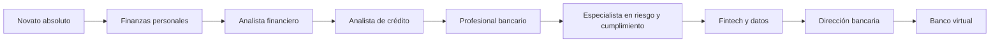

# Ruta de aprendizaje

```mermaid
flowchart LR
  A[Novato absoluto] --> B[Finanzas personales]
  B --> C[Analista financiero]
  C --> D[Analista de crédito]
  D --> E[Profesional bancario]
  E --> F[Especialista en riesgo y cumplimiento]
  F --> G[Fintech y datos]
  G --> H[Dirección bancaria]
  H --> I[Banco virtual]
```

La progresión evita saltos: primero se domina el dinero personal; después, el lenguaje contable y económico; luego, los productos, riesgos y operaciones institucionales.
