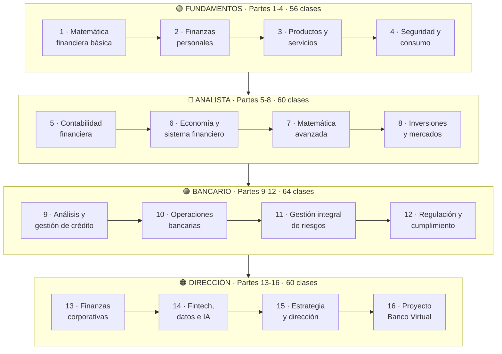
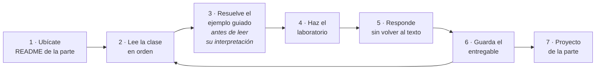

# Ruta de aprendizaje

Cómo avanza el programa y por dónde entrar según tu punto de partida. **La progresión
evita saltos**: primero se domina el dinero propio, después el lenguaje contable y
económico, luego los productos, riesgos y operaciones de una institución.

---

## La progresión completa



---

## Qué se puede hacer al terminar cada etapa

| Etapa | Al terminar puedes | Clases |
|---|---|:---:|
| 🟢 **Fundamentos** | Controlar tu dinero, comparar productos por costo total, reconocer fraude y ejercer tus derechos | 56 |
| 🔵 **Analista** | Leer y elaborar estados financieros, valorar activos, entender la política monetaria y construir una cartera | 60 |
| 🟣 **Bancario** | Evaluar crédito, operar procesos bancarios, medir riesgos y aplicar el marco regulatorio | 64 |
| 🟠 **Dirección** | Analizar empresas, diseñar estrategia tecnológica, dirigir un banco y defender sus decisiones | 60 |

---

## Por dónde entrar

<table>
<thead><tr><th>Si eres…</th><th>Empieza en</th><th>Por qué</th></tr></thead>
<tbody>
<tr>
<td><b>🌱 Alguien sin conocimientos previos</b></td>
<td><a href="../modules/00-matematica-financiera-basica/classes/01-diagnostico-y-operaciones-esenciales.md">Parte 1, clase 1</a></td>
<td>El programa está diseñado para empezar aquí, sin nada previo</td>
</tr>
<tr>
<td><b>💰 Alguien que quiere ordenar su dinero</b></td>
<td><a href="../modules/00-matematica-financiera-basica/README.md">Partes 1 – 4</a></td>
<td>Con esas cuatro partes tienes todo lo que necesitas para tu vida financiera</td>
</tr>
<tr>
<td><b>🎓 Estudiante de finanzas o contabilidad</b></td>
<td><a href="../modules/04-contabilidad-financiera/README.md">Parte 5</a></td>
<td>Revisa antes la Parte 1 si tu base matemática no está firme</td>
</tr>
<tr>
<td><b>📊 Analista financiero</b></td>
<td><a href="../modules/06-matematica-financiera-avanzada/README.md">Parte 7</a> · <a href="../modules/12-finanzas-corporativas-y-banca-empresarial/README.md">Parte 13</a></td>
<td>Duración, valoración y análisis de empresas; vuelve a la 5 si hace falta</td>
</tr>
<tr>
<td><b>🏦 Profesional bancario</b></td>
<td><a href="../modules/08-analisis-y-gestion-de-credito/README.md">Parte 9</a></td>
<td>Las Partes 9 a 12 son el núcleo del oficio; la 5 y la 6 son prerrequisito</td>
</tr>
<tr>
<td><b>⚠️ Especialista en riesgo</b></td>
<td><a href="../modules/10-gestion-integral-de-riesgos/README.md">Parte 11</a></td>
<td>Requiere la Parte 9 para PD, LGD y EAD</td>
</tr>
<tr>
<td><b>📋 Cumplimiento y auditoría</b></td>
<td><a href="../modules/11-regulacion-cumplimiento-y-auditoria/README.md">Parte 12</a></td>
<td>Se apoya en las Partes 10 y 11 para el contexto operativo y de riesgo</td>
</tr>
<tr>
<td><b>💻 Perfil tecnológico</b></td>
<td><a href="../modules/13-fintech-datos-e-inteligencia-artificial/README.md">Parte 14</a></td>
<td>Requiere las Partes 9 y 11 para entender qué se está modelando</td>
</tr>
<tr>
<td><b>🎯 Dirección y gestión</b></td>
<td><a href="../modules/14-estrategia-y-direccion-bancaria/README.md">Parte 15</a></td>
<td>Supone las Partes 11 y 12; la 16 integra todo</td>
</tr>
<tr>
<td><b>👩‍🏫 Docente</b></td>
<td><a href="guia-docente.md">Guía docente</a></td>
<td>Agenda de 90 minutos, rúbricas y adaptación por contexto</td>
</tr>
</tbody>
</table>

> **Advertencia sobre los atajos.** Las Partes 11 a 16 encadenan conceptos de las
> anteriores de forma explícita: la Parte 11 usa PD y LGD de la 9, la 16 usa todo. Entrar
> por el medio funciona si conoces esos conceptos; si no, el material lo señalará
> constantemente.

---

## Cadenas de dependencia

Qué necesitas antes de cada parte.

| Parte | Requiere | Motivo |
|:---:|---|---|
| 5 | 1 | Valor del dinero en el tiempo |
| 7 | 1 · 5 | Descuento y estados financieros |
| 8 | 6 · 7 | Tasas, curvas y duración |
| 9 | 5 · 6 | Estados financieros y ciclo económico |
| 10 | 3 · 6 | Productos y sistema financiero |
| 11 | 7 · 8 · 9 | Duración, VaR, PD/LGD/EAD |
| 12 | 9 · 10 · 11 | Crédito, operaciones y riesgos |
| 13 | 5 · 7 · 9 | Contabilidad, VPN y crédito |
| 14 | 9 · 11 · 12 | Modelos, riesgo y regulación |
| 15 | 11 · 12 · 13 | Riesgos, marco normativo y rentabilidad |
| 16 | **Todas** | Es el proyecto integrador |

---

## Ritmos

| Modalidad | Dedicación | Duración total | Por etapa |
|---|---|---|---|
| **Intensiva** | 12 h/semana | 30 semanas | ~7,5 semanas |
| **Estándar** | 8 h/semana | 45 semanas | ~11 semanas |
| **Extendida** | 6 h/semana | 60 semanas | ~15 semanas |

Cada clase son **90 minutos de sesión** más el tiempo del laboratorio y del entregable.
El total del programa es de **360 horas de sesión**.

---

## El método de estudio



### Lo que más importa

| Paso | Por qué |
|---|---|
| **Resolver antes de leer la interpretación** | Es donde se produce el aprendizaje; leer la conclusión primero solo la memoriza |
| **Responder sin volver al texto** | Distingue reconocer de saber |
| **Guardar el entregable** | El portafolio es la evidencia del recorrido y el insumo del proyecto final |
| **No saltarse el laboratorio** | El programa enseña a decidir, y eso solo se ejercita decidiendo |

---

## Tu portafolio

Cada clase produce un entregable. Al final tendrás **240 evidencias** organizadas así:

```text
portfolio/
├── parte-01/
│   ├── clase-01/
│   ├── clase-02/
│   └── ...
├── parte-02/
└── ...
```

El proyecto final (Parte 16, clase 18) consiste en **defender** las decisiones que
tomaste, y el portafolio es lo que las sostiene.

---

**Ver también:** [Mapa de competencias](mapa-competencias.md) ·
[Guía docente](guia-docente.md) · [Índice de las 240 clases](../SYLLABUS.md) ·
[Estado del contenido](../STATUS.md)
